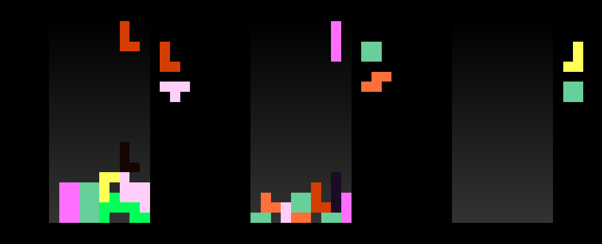

# testing-rendering
### _Hello_

This is a project to test common lisp.

Maybe im going to add multiplayer later.

### Third iteration

(added option to have draw multipla games at once.)

### Second iteration

### First iteration

